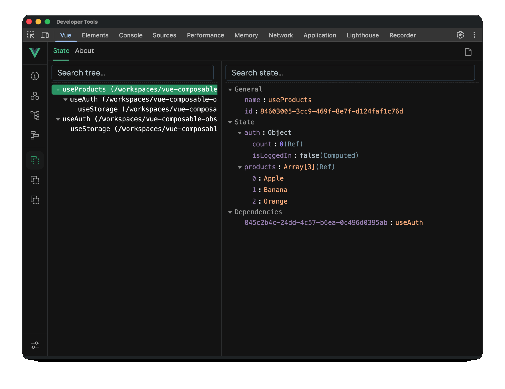

# Vue Composable Observer

Observe, inspect and debug Vue composables at runtime.

Vue Composable Observer reveals the hidden architecture of your Vue application by visualizing composable relationships, component ownership and runtime state directly inside Vue DevTools.

<p align="center">
  
</p>

## Features

* 🔍 Runtime composable inspection
* 🌳 Composable dependency graph
* 📦 Component → composable relationships
* ⚡ Reactive state change tracking
* 🛠 Vue DevTools integration
* 🚀 Vite support
* 💚 Vue 3 support
* 🧹 Zero production overhead

## Why?

As Vue applications grow, composables become an invisible architectural layer.

Over time it becomes difficult to answer questions like:

* Which composable created this state?
* Which composables depend on each other?
* Why did this ref change?
* Why was this composable instantiated?
* Which component is using this composable?
* What caused this reactive update?

Vue Composable Observer makes those relationships visible.

## Installation

```bash
pnpm add -D @runtime-labs/composable-plugin
```

## Setup

### Vite

```ts
import { defineConfig } from 'vite'
import vue from '@vitejs/plugin-vue'

import {
  VueComposableObserver,
} from '@runtime-labs/composable-plugin/unplugin'

export default defineConfig({
  plugins: [
    vue(),
    VueComposableObserver.vite(),
  ],
})
```

### Vue

```ts
import { createApp } from 'vue'

import {
  ComposableObserverVuePlugin,
} from '@runtime-labs/composable-plugin/vue'

import App from './App.vue'

createApp(App)
  .use(ComposableObserverVuePlugin)
  .mount('#app')
```

## Usage

Start your application and open Vue DevTools.

A new **Composable Observer** inspector will appear.

### Runtime View

Visualizes composable hierarchy and runtime relationships.

```txt
useProducts
 ├─ useApi
 └─ useAuth
     └─ useStorage
```

### Component View

Shows which components are using specific composables.

```txt
ProductPage
 ├─ useProducts
 └─ useAuth
```

### Flat View

Provides a searchable list of all tracked composables.

## Example

Given the following composable:

```ts
export function useProducts() {
  const { user } = useAuth()
  const { get } = useApi()

  const products = ref([])

  return {
    products,
  }
}
```

Composable Observer automatically tracks:

* composable creation
* composable nesting
* component ownership
* runtime relationships
* state changes

No code changes are required.

## Packages

| Package                           | Description                                       |
| --------------------------------- | ------------------------------------------------- |
| `@runtime-labs/composable-core`   | Runtime tracking engine                           |
| `@runtime-labs/composable-plugin` | Build-time transform and Vue DevTools integration |

## Roadmap

### Runtime Inspection

* [ ] Timeline view
* [ ] State history
* [ ] Runtime graph export
* [ ] Advanced filtering

### Static Analysis

* [ ] Circular dependency detection
* [ ] Composable audit CLI
* [ ] Architecture insights
* [ ] Performance analysis

## Contributing

Issues, feature requests and pull requests are welcome.

## License

MIT
